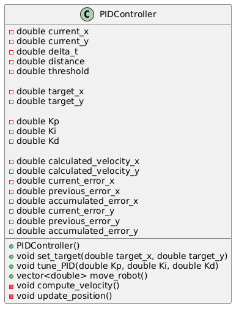

[](https://codecov.io/gh/koustubh1012/tdd_pid_controller) [](LICENSE)

# PID Controller for Mobile Robot

This project is designed to create a **PID Controller** that computes velocities in the x and y directions to help control a mobile robot. The controller computes the velocity based on the robot's current position and the target position, adjusting its velocity as per the PID control algorithm.

## Table of Contents
- [Introduction](#introduction)
- [Class Overview](#class-overview)
- [Attributes](#attributes)
- [Methods](#methods)
  - [PIDController()](#pidcontroller)
  - [set_target()](#set_target)
  - [tune_PID()](#tune_pid)
  - [compute_velocity()](#compute_velocity)
  - [update_position()](#update_position)
  - [move_robot()](#move_robot)
- [Usage](#usage)
- [Example](#example)

## Introduction

The **PID Controller** (Proportional-Integral-Derivative) is used in control systems to continuously adjust an output based on the current state and the desired state. In this case, it controls the velocity of a mobile robot to move towards a target position in 2D space (x, y) while minimizing the error between its current position and the target.

## Class Overview

The `PIDController` class encapsulates the PID control mechanism and tracks key variables such as position, error, and tuning parameters (`Kp`, `Ki`, `Kd`). Here is the Class UML diagram



### Attributes

The class includes the following attributes:

1. **current_x**: The current x-coordinate of the robot.
2. **current_y**: The current y-coordinate of the robot.
3. **delta_t**: The time interval or frequency of the controller (time step for integration).
4. **distance**: The Euclidean distance between the robot and the target.
5. **threshold**: The allowed margin of error near the target setpoint.
6. **target_x**: The x-coordinate of the target position.
7. **target_y**: The y-coordinate of the target position.
8. **Kp**: Proportional gain used in the PID control.
9. **Ki**: Integral gain used in the PID control.
10. **Kd**: Derivative gain used in the PID control.
11. **calculated_velocity_x**: The controller output for velocity in the x-direction.
12. **calculated_velocity_y**: The controller output for velocity in the y-direction.
13. **current_error_x**: The current error in the x-direction (target_x - current_x).
14. **previous_error_x**: The previous error in the x-direction, used for the derivative term.
15. **accumulated_error_x**: The accumulated error in the x-direction, used for the integral term.
16. **current_error_y**: The current error in the y-direction (target_y - current_y).
17. **previous_error_y**: The previous error in the y-direction, used for the derivative term.
18. **accumulated_error_y**: The accumulated error in the y-direction, used for the integral term.

### Methods

#### PIDController()

Constructor that initializes the controller with default values for `current_x`, `current_y`, `delta_t`, `distance`, and `threshold`. Can make use of polymorphism for flexibility. Example initialization:

```cpp
PIDController(double init_x = 0.0, double init_y = 0.0, double delta_time = 0.01, double threshold = 0.1);
```

#### set_target(double target_x, double target_y)

Sets the target position of the robot. The robot will adjust its velocities to move towards this point.

```cpp
void set_target(double target_x, double target_y);
```

#### tune_PID(double Kp, double Ki, double Kd)

Tunes the PID parameters (`Kp`, `Ki`, `Kd`) for better control. Adjust these gains based on the system's needs for proportional, integral, and derivative control.

```cpp
void tune_PID(double Kp, double Ki, double Kd);
```

#### compute_velocity(double pos)

Computes the velocity in one direction (either x or y) based on the current position and the target. The function calculates the velocity by applying the PID formula:

```cpp
double compute_velocity(double pos);
```

#### update_position()

Updates the current position of the robot in both x and y directions based on the computed velocities and the time step `delta_t`.

```cpp
void update_position();
```

#### move_robot()

Moves the robot towards the target by calling `compute_velocity()` for both x and y directions, and then updating the position with `update_position()`.

```cpp
vector<double> move_robot();
```

## Usage

1. Create an instance of `PIDController`.
2. Set the target using `set_target()`.
3. Tune the PID gains using `tune_PID()`.
4. Call `move_robot()` in a compute the velocities and move the robot incrementally towards the target. The function returns the final coordinates of the robot as a vector

## Example

```cpp
int main() {
    PIDController controller(0.0, 0.0, 0.01, 0.1);
    
    controller.set_target(10.0, 15.0);
    controller.tune_PID(1.0, 0.1, 0.05);

    std::vector<double> robot_state;
    robot_state = controller.move_robot();
    std::cout << "Robot reached the target!" << robot_state[0] <<" "<<robot_state[1];
    
    return 0;
}
```

This example shows how to initialize a `PIDController`, set the target, tune the PID gains, and move the robot towards the target. The loop will keep running until the robot reaches the target within the threshold.